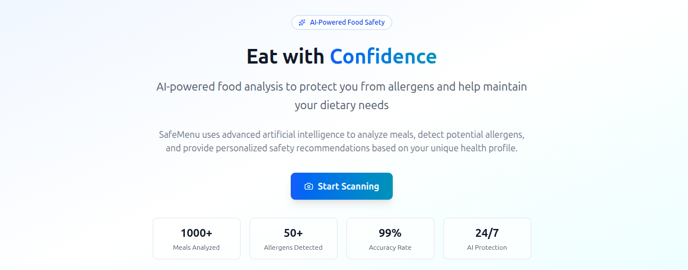

# SafeMenu AI

  

## Overview
SafeMenu AI is a health-focused application that helps users analyze meals for allergens and dietary compatibility. Using AI-powered analysis, users can scan food, upload menus, or type meal names to receive safety assessments tailored to their personal health profile.

## Key Features
- AI-Powered Meal Analysis: Upload images or type meal names to receive detailed ingredient analysis
- Personalized Health Profiles: Complete your health profile including allergies, dietary restrictions, and preferences
- Menu Compatibility Scanning: Scan hotel/restaurant menu QR codes to identify safe meal options
- Multi-Format Menu Upload: Upload menus in PDF, GIF, WEBP, JPG, JPEG, or PNG formats
- Interactive AI Chat: Discuss meal options and get follow-up recommendations through chat
- Visual Safety Indicators: Color-coded results (green=safe, yellow=moderate, red=danger)
- Health Tracking: Store scan history and chat conversations for health monitoring
- Responsive Design: Mobile-first interface with health-optimized colors and fonts

## Technology Stack
*Frontend*
1. React with Vite
2. Tailwind CSS 4
3. Responsive, mobile-first design
4. Health-optimized color schemes and typography

*Backend*
1. MERN Stack (MongoDB, Express, React, Node.js)
2. Google Vertex AI for machine learning models
3. Genkit for AI orchestration
4. Gemini for AI discussions

*Development Tools*
1. pnpm as package manager
2. Minimal folder structure
3. Clean, readable, and scalable codebase

*Safety Assessment System*
1. Green: Safe for consumption based on user profile
2. Yellow: Moderate risk - requires caution or limited consumption
3. Red: Contains allergens or incompatible ingredients

*Analysis Includes*
1. Nutritional percentages (fat, sugar, glucose, starch, water)
2. Common allergen detection (groundnuts, dairy, gluten, etc.)
3. Dietary compatibility analysis
4. Ingredient breakdown

*Target Users*
1. Individuals with food allergies
2. People with specific dietary requirements
3. Health-conscious consumers
4. Those managing medical conditions through diet
5. Anyone seeking to make informed food choices

*Security & Privacy*
- Secure user authentication
- Protected health information
- Encrypted data storage
- Secure file uploads
- Confidential AI processing

The application is designed to provide reliable, accurate food analysis while maintaining a simple and intuitive user experience for health-conscious individuals.

## Demo video link
[LIVE VIDEO HERE](https://youtu.be/7w9wSA5x8h8)